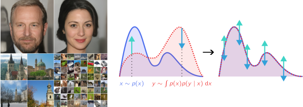

# Learning Stationary Markov Processes with Contrastive Adjustment

Ludvig Bergenstråhle, Jens Lagergren, and Joakim Lundeberg

arXiv: <https://arxiv.org/abs/2303.05497>



We introduce a new optimization algorithm, termed *contrastive adjustment*, for learning Markov transition kernels whose stationary distribution matches the data distribution.
Contrastive adjustment is not restricted to a particular family of transition distributions and can be used to model data in both continuous and discrete state spaces.
Inspired by recent work on noise-annealed sampling, we propose a particular transition operator, the *noise kernel*, that can trade mixing speed for sample fidelity.
We show that contrastive adjustment is highly valuable in human-computer design processes, as the stationarity of the learned Markov chain enables local exploration of the data manifold and makes it possible to iteratively refine outputs by human feedback.
We compare the performance of noise kernels trained with contrastive adjustment to current state-of-the-art generative models and demonstrate promising results on a variety of image synthesis tasks.


## Installation

A Conda environment with the required dependencies can be created with the following command:

```
conda env create -f environment.yml
```

Activate the environment and install the CLI associated with this package by running:

```
conda activate nkca
pip install --no-deps -e .
```

After the installation is complete, you should have access to the commands `nkca-train`, `nkca-metrics`, `nkca-sample`, and `nkca-interactive`, described in the following sections.


## Training

Models are trained with the command `nkca-train`.
Example usage:

```
nkca-train --hidden-size=128 \
           --dim-mults='[1, 2, 4, 8]' \
           --epochs=500 \
           --batch-size=128 \
           --resize=128 \
           --data-augmentation='[fliph]' \
           --dataset=/path/to/dataset \
           --save-dir=/path/to/output/directory
```

where the `dataset` directory contains the training set images.
It does not need to be of any specific structure;
the dataloader will recursively traverse all subdirectories in this path and load the image files it finds.

The following arguments were used to train the models in the paper:

|                          |  hidden-size | dim-mults          | epochs | batch-size  | resize | data-augmentation |
|--------------------------|--------------|--------------------|--------|-------------|--------|-------------------|
| CelebA-HQ                |  256         | [1, 1, 2, 2, 4, 4] | 500    | 32          | 256    | Unset             |
| LSUN Church              |  128         | [1, 2, 4, 8]       | 500    | 32          | 128    | Unset             |
| CIFAR-10                 |  128         | [1, 2, 4, 8]       | 700    | 128         | Unset  | [fliph]           |
| CIFAR-10 (categorical\*) |  128         | [1, 2, 4, 8]       | 500    | 512         | Unset  | [fliph]           |

\* To train a categorical model, the `--discrete` flag additionally needs to be specified.
The dataset will be discretized to the number of categories set by the `--num-classes` flag (defaults to 10).

Training progress is logged to a TensorBoard event file in the output directory and can be monitored with the command `tensorboard --logdir=/path/to/output/directory`.


## Evaluation

FID and IS scores can be computed with the command `nkca-metrics`:

```
nkca-metrics /path/to/checkpoint.pth /path/to/dataset --save-dir=/path/to/output/directory
```

By default, `nkca-metrics` generates the same number of samples as the number of examples in the reference dataset.
This can be changed with the `--num-samples` argument.


## Image synthesis and variant generation

The command `nkca-sample` is used to sample images from a trained model.

### Unconditional samples

Unconditional samples can be generated with the following command:

```
nkca-sample /path/to/checkpoint.pth --num-samples=100 --save-dir=/path/to/output/directory
```

### Image variants

Image variants can be generated with the following command:

```
nkca-sample /path/to/checkpoint.pth \
            initial_image \
            --max-sampling-noise=0.2 \
            --min-sampling-noise=0.2 \
            --num-sampling-steps=100 \
            --save-dir=/path/to/output/directory
```

Here, we have kept the noise level constant at 0.2.
Alternatively, the flag `--noise-level-max` can be set to a higher value to increase the diversity of generated samples, and the flag `--noise-level-min` can be set to a lower value to increase fidelity.
To produce more than one variant in a single run, multiple `initial_image` paths may be specified.

### Inpainting

Inpaintings can be generated with the following command:

```
nkca-sample /path/to/checkpoint.pth \
            initial_image \
            --inpainting-mask=/path/to/inpainting_mask.png \
            --save-dir=/path/to/output/directory
```

where the `inpainting-mask` is an image with the same shape as the reference image `initial_image`.
The inpainting mask should be non-zero for the image regions of the reference to inpaint.


## Interactive sampling

The command `nkca-interactive` runs the learned Markov chain interactively.
This utility can be used to understand the behavior of the chain as the noise level is decreased or increased during sampling.
Example usage:

```
nkca-interactive /path/to/checkpoint.pth --visualize=z
```


## Citation

``` bibtex
@article{bergenstrahle23learning,
  author          = {Bergenstr{\aa}hle, Ludvig and Lagergren, Jens and Lundeberg, Joakim},
  title           = {Learning Stationary Markov Processes With Contrastive Adjustment},
  journal         = {CoRR},
  year            = 2023,
  url             = {http://arxiv.org/abs/2303.05497},
  archivePrefix   = {arXiv},
  eprint          = {2303.05497},
  primaryClass    = {cs.LG},
}
```
